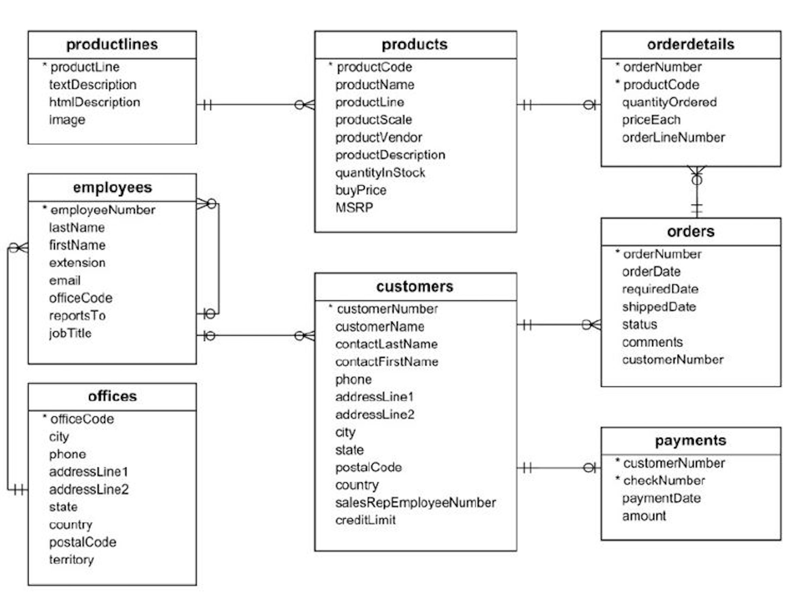

# Cars Classic Model Retail Project - SQL
## Introduction
This project showcases my domain knowledge in data analysis by applying it to a real-world business context not just for querying data using SQL, but for uncovering insights that provide meaningful business relevance and support data-driven decision-making. It was part of my course in Udemy for data analyst course.
## Project Background
The Classic Model dataset represents a retailer of scale models of classic cars, and the data ranges from 2003 to mid-2005. This organization focuses on B2B sales to retailers. This contains a significant amount of information in a typical business relating to product sales and sales by specific team members within the organization.

This project thoroughly analyzes and synthesizes the data to uncover critical insights such as the overall sales performance within the organization, as well as the sales representatives who had the largest impact on sales.

Insights and recommendations are provided on the following key areas:
* __Regional Sales Performance:__ Evaluation of historical sales patterns across different countries focusing on regional performance, order volume and Average Order Value (AOV).
* __Product Level Performance:__ An analysis of various products and product lines, understanding their impact on sales including product profitability and the top 10 best-selling products. 
* __Operational Efficiency:__ An analysis of logistics performance on orders shipped on time.
* __Top Performers:__ An evaluation of sales representatives who had the largest impact on sales.
* __Top Spenders & Loyal Customers:__ A segmentation of customer loyalty and retention.

Targeted SQL queries regarding various business questions can be found [here](classicmodel_sales_project.sql).

## Data Structure & Initial Checks
Classic Model cars database structure as seen below consists of eight tables: customers, orders, orderdetails, products, productlines, payments, employees, and offices with a total row count of 3,864 records. A description of each table is as follows:
* __Customers:__ Stores customer’s data.
* __Orders:__ Stores sales orders placed by customers.
* __Orderdetails:__ Stores sales order line items for each sales order.
* __Products:__ Stores a list of scale model cars.
* __Productlines:__ Stores a list of product line categories.
* __Payments:__ Stores payments made by customers based on their accounts.
* __Employees:__ Stores all employee information as well as the organization structure such as who reports to whom.
* __Offices:__ Stores sales office data.

## Executive Summary
## Overview of Findings
The average number of orders placed by each customer is 3.32, indicating a moderate level of repeat purchases. Around 95.4% of orders were shipped on time, reflecting strong operational efficiency. In terms of profitability, the top-performing products include 1992 Ferrari 360 Spider Red, 1952 Alpine Renault 1300, and 2001 Ferrari Enzo, which generated the highest net profits. 

When analyzing performance by country, the United States, France, and Germany recorded the highest average order amounts, highlighting them as key markets. 

Furthermore, customer segmentation based on total purchase amount categorized clients into low, medium, high and very high-value segments. High-value customers—such as Australian Collectors Co., La Rochelle Gifts, and Euro+ Shopping Channel—contribute a significant portion of total revenue, while medium-value customers represent the largest group with strong potential for growth. 

These insights emphasize the importance of maintaining relationships with high-value clients, nurturing medium-value customers for upselling opportunities, and re-engaging low-value customers to boost retention and overall profitability.

Below is the overview page from the Tableau dashboard and more examples are included throughout the report.The entire interactive dashboard can be downloaded [here](https://public.tableau.com/views/ClassicCarModelSalesProject/Dashboard2?:language=en-US&:sid=&:redirect=auth&:display_count=n&:origin=viz_share_link)

## Insights Deep Dive
* __Regional Sales Performance:__

  

